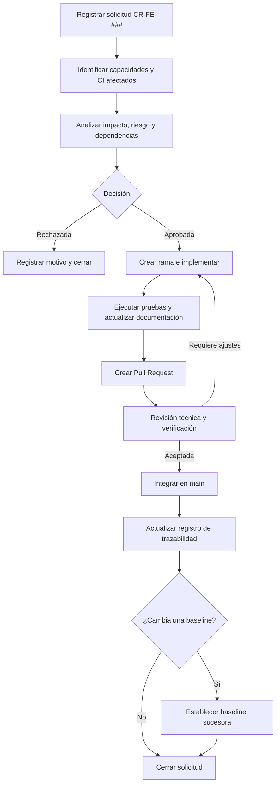

# Estrategia de gestión de configuración del frontend

Esta documentación establece cómo se identifican, versionan, revisan y trazan los elementos de configuración del frontend de DGSITES. Su alcance comprende este repositorio y el contrato de API que comparte con el backend.

## Contenido

1. [Elementos de configuración](elementos-configuracion/README.md)
2. [Baselines](baselines/README.md)
3. [Control de cambios](control-cambios/README.md)
4. [Trazabilidad](trazabilidad/README.md)
5. [Roles y responsabilidades](roles-responsabilidades/README.md)
6. [Versionado y liberaciones](versionado-liberaciones/README.md)

## Principios

- Todo cambio debe tener un motivo identificable y un alcance delimitado.
- Los CI afectados deben identificarse antes de implementar el cambio.
- Ningún cambio se integra sin revisión y evidencia proporcional a su riesgo.
- Las baselines establecidas son inmutables; un cambio aprobado origina una baseline sucesora cuando corresponda.
- La trazabilidad se registra durante el cambio, no después de finalizarlo.
- Los cambios de `CI-SH-API` requieren coordinación con el backend.

## Modelo integral

## Controles de la estrategia

| Control | Evidencia | Estado |
|---|---|---|
| Identificación de CI | Inventario y niveles de control | Establecido |
| Baselines iniciales | `BL-FE-FUN-001` y `BL-FE-DEV-001` | Establecidas |
| Solicitudes de cambio | Identificador `CR-FE-###` y datos obligatorios | Definido documentalmente |
| Revisión de cambios | Pull Request, revisión y pruebas aplicables | Definido documentalmente |
| Trazabilidad | Relación entre solicitud, CI, commits, pruebas y baseline | Definida documentalmente |
| Protección de rama | Restricciones de integración sobre `main` | Habilitada con una aprobación requerida |
| Versionado y liberación | Versión de los manifiestos, tags y GitHub Releases | Automatización definida para tags semánticos |
| Pruebas representativas | Evidencia de los flujos funcionales críticos | Pendiente |
| Configuración por ambiente | Valores externos centralizados y documentados | Pendiente |
| Contrato compartido | Especificación y pruebas coordinadas | Pendiente con el backend |
| Automatización | Verificación, construcción, despliegue y liberación mediante GitHub Actions | Implementada |

## Contabilidad del estado de configuración

La información necesaria para reconstruir el estado de un cambio se distribuye entre:

- El inventario de CI y las baselines de esta documentación.
- La solicitud de cambio y su decisión.
- La rama, el Pull Request y los commits asociados.
- Las evidencias de prueba y revisión.
- El registro de trazabilidad actualizado al cerrar el cambio.

## Auditoría

Antes de establecer una baseline sucesora se debe comprobar que:

- El commit de referencia existe y corresponde a la rama controlada.
- Los CI incluidos y sus desviaciones están documentados.
- La solicitud y el Pull Request permiten reconstruir la decisión.
- Las pruebas exigidas fueron ejecutadas y sus resultados están registrados.
- La documentación refleja el comportamiento y la configuración resultantes.
- Los cambios del contrato compartido tienen una referencia coordinada con el backend.
