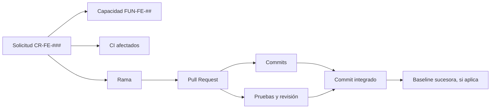

# Trazabilidad de la configuración del frontend

[Inicio](../README.md) · [CI](../elementos-configuracion/README.md) · [Baselines](../baselines/README.md) · [Control de cambios](../control-cambios/README.md) · [Roles](../roles-responsabilidades/README.md) · [Versionado](../versionado-liberaciones/README.md)

La trazabilidad permite reconstruir por qué se realizó un cambio, qué elementos modificó, quién lo revisó, cómo se verificó y en qué configuración quedó incorporado.

## Cadena de trazabilidad

Una solicitud puede no afectar una capacidad funcional, pero siempre debe relacionarse al menos con un CI. La baseline se registra solamente cuando el cambio establece una nueva referencia controlada.

## Datos del registro

| Campo | Propósito |
|---|---|
| Solicitud | Identificar el origen y la decisión del cambio. |
| Capacidades | Indicar el comportamiento afectado o confirmar que no cambia. |
| CI | Delimitar los artefactos bajo control. |
| Rama | Ubicar el trabajo realizado. |
| Pull Request | Conservar discusión, aprobación y evidencia de integración. |
| Commits | Identificar exactamente las modificaciones. |
| Pruebas y resultado | Demostrar la verificación ejecutada. |
| Revisor y verificador | Registrar las responsabilidades ejercidas. |
| Commit integrado | Fijar el estado que llegó a `main`. |
| Baseline | Relacionar la nueva referencia cuando corresponda. |
| Estado | Mostrar si la solicitud está en análisis, aprobada, en implementación, integrada, rechazada o cerrada. |

## Registro de cambios

La siguiente tabla se completa al gestionar cambios reales; no se registran identificadores ni evidencias ficticias.

| Solicitud | Capacidades | CI | Rama / Pull Request | Commits | Pruebas | Baseline | Estado |
|---|---|---|---|---|---|---|---|
| _Por registrar_ | — | — | — | — | — | — | — |

## Trazabilidad del contrato compartido

Cuando una solicitud modifica `CI-SH-API`, el registro debe agregar:

- Operación, datos de solicitud, respuesta o tratamiento de error afectado.
- Compatibilidad esperada entre las versiones de frontend y backend.
- Referencia al cambio coordinado del backend, cuando exista.
- Orden de integración o despliegue requerido.
- Evidencia de la prueba de integración acordada.

El cambio no se considera cerrado mientras la relación entre ambos componentes sea ambigua o la compatibilidad esperada no haya sido verificada.

## Criterios de cierre

Una solicitud puede cerrarse cuando:

- La decisión y el alcance final están registrados.
- Los commits integrados corresponden al cambio aprobado.
- La revisión y las pruebas requeridas tienen resultado satisfactorio.
- Las desviaciones aceptadas están documentadas.
- La documentación afectada está actualizada.
- Se identificó la baseline sucesora o se justificó por qué no corresponde crearla.

## Contabilidad del estado

El estado vigente se obtiene a partir del último commit integrado en `main`, las solicitudes cerradas, las baselines establecidas y sus desviaciones conocidas. El registro no reemplaza el historial de Git: lo complementa con la justificación, la decisión y la evidencia que el historial por sí solo no expresa.
